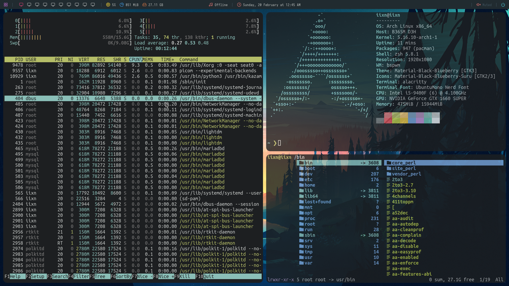

# dotfiles
Mi configuración de Arch Linux



Programas que uso:


|   Rofi   |
|----------|
|   Kazam  |
|   VSC    |
|  Thunar  |


Como tipo de shell:

**ZSH**

Para el prompt de la terminal no uso 
```powerlevel10k```
en cambio uso 
```starship```
En mi .config hay un archivo llamado starship.toml.Ahí puedes configurar el prompt

